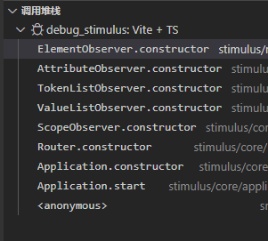
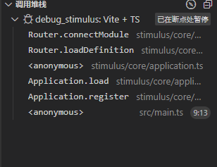
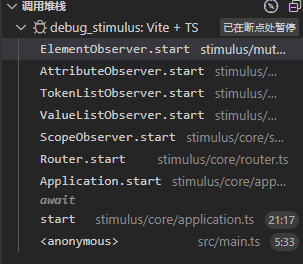
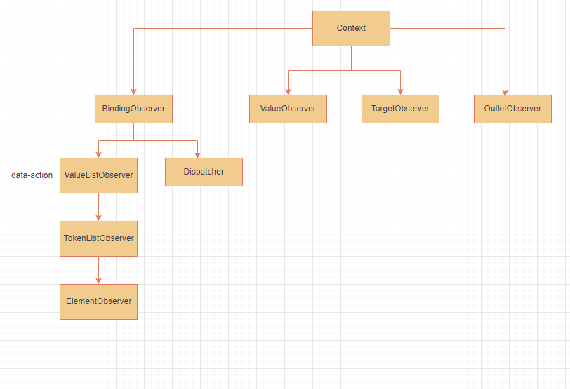

# stimulus 运行原理分析

## 总的流程分析

创建依赖实列



注册 Controller



文档加载完成后的 start



从上到下的逻辑到此结束，接下来，通过 ElementObserver，自低向上来链接 dom 节点和 Controller。[(真启动)](#register-阶段)

## 真启动

首先从根节点 html 开始，寻找 matchElement[(match 逻辑)](#match逻辑)

element_observer 的 refresh()的作用，主要是找出所有当前元素的后代元素，这些后代元素带有特定的属性，比如"[data-controller]"。

然后对匹配到的元素，根据 this.elements 的情况作增删操作。

首次运行时，一般会匹配到某个根 controller,类似于"<div id="app" data-controller="demo"></div>"。然后 add 这个元素[(元素添加)](#元素添加)

```ts
//element_observer.ts
  refresh() {
    if (this.started) {

      //在我们的最小实现例子中，matches的值为"<div id="app" data-controller="demo"></div>"
      const matches = new Set(this.matchElementsInTree())

      for (const element of Array.from(this.elements)) {
        if (!matches.has(element)) {
          this.removeElement(element)
        }
      }

      for (const element of Array.from(matches)) {
        this.addElement(element)
      }
    }
  }
```

### match 逻辑

选出当前元素的所有带[data-controller]属性的后代元素

```ts
//element_observer.ts
//首次match时 tree=html
  private matchElementsInTree(tree: Element = this.element): Element[] {
    return this.delegate.matchElementsInTree(tree)
  }

//attribute_observer.ts
//首次match时 this.selector=[data-controller]
//该函数的作用是选出当前元素的所有带[data-controller]属性的后代元素
matchElementsInTree(tree: Element): Element[] {
    const match = this.matchElement(tree) ? [tree] : []
    const matches = Array.from(tree.querySelectorAll(this.selector))
    return match.concat(matches)
  }
```

### 元素添加

将匹配到的 controller 对应的 dom 添加到自身缓存

```ts
//element_observer.ts
private addElement(element: Element) {
    if (!this.elements.has(element)) {
      if (this.elementIsActive(element)) {
        this.elements.add(element)
        if (this.delegate.elementMatched) {
          this.delegate.elementMatched(element)
        }
      }
    }
  }
```

然后触发 attributeObserver 的 match 逻辑,
attributeObserver 会直接触发 TokenListObserver 的 match 逻辑

```ts
//toKEN_list_observer.ts
  elementMatchedAttribute(element: Element) {
    this.tokensMatched(this.readTokensForElement(element))
  }

//首次运行时，attributeName="data-controller"
  private readTokensForElement(element: Element): Token[] {
    const attributeName = this.attributeName
    const tokenString = element.getAttribute(attributeName) || ""
    return parseTokenString(tokenString, element, attributeName)
  }

// 返回一个数组，定义如下：
export interface Token {
  element: Element
  attributeName: string
  index: number
  content: string //我们传入的controller字符串会存储在这里
}

function parseTokenString(tokenString: string, element: Element, attributeName: string): Token[] {
  return tokenString
    .trim()
    .split(/\s+/)
    .filter((content) => content.length)
    .map((content, index) => ({ element, attributeName, content, index }))
}
```

经过 parseTokenString()后，会解析出 data-controller 属性的所有值。然后进入 tokensMatched()的处理。
在这一步，会缓存 element 的所有 TOKEN，然后触发 ValueListObserver 的 match 逻辑。[(value 匹配逻辑)](#value匹配逻辑)

```ts
//处理所有解析到的TOKEN
private tokensMatched(tokens: Token[]) {
    tokens.forEach((token) => this.tokenMatched(token))
  }

private tokenMatched(token: Token) {
    this.delegate.tokenMatched(token)
    this.tokensByElement.add(token.element, token)
  }

```

### value 匹配逻辑

首先会针对传入的 TOKEN 作解析[(TOKEN 解析)](#token解析)。解析完成后会返回一个 scope 实例，这个 scope 实例与 element-controller 对关联。将 element-scope 对传给 ScopeObserver 去匹配 value[(elementMatchedValue)](#elementmatchedvalue)

```ts
//value_list_observer.ts
tokenMatched(token: Token) {
    const { element } = token
    const { value } = this.fetchParseResultForToken(token)
    if (value) {
      this.fetchValuesByTokenForElement(element).set(token, value)
      this.delegate.elementMatchedValue(element, value)
    }
  }
```

#### TOKEN 解析

首先查看当前有没有解析缓存，如果没有则调用 parseToken(),进入到 ScopeObserver 中解析 Token[（ScopeObserver 解析)](#scopeobserver解析),解析完成后会返回一个 scope 实例，这个 scope 实例与 element-controller 对关联

```ts
//value_list_observer.ts
  private fetchParseResultForToken(token: Token) {
    let parseResult = this.parseResultsByToken.get(token)
    if (!parseResult) {
      parseResult = this.parseToken(token)
      this.parseResultsByToken.set(token, parseResult)
    }
    return parseResult
  }

  private parseToken(token: Token): ParseResult<T> {
    try {
      //触发ScopeObserver解析
      const value = this.delegate.parseValueForToken(token)
      return { value }
    } catch (error: any) {
      return { error }
    }
  }

```

#### ScopeObserver 解析

在 scopObserve 里面触发 Router 的 createScopeForElementAndIdentifier(),为 element-controller 对创建 scope[(scop 创建逻辑)](#scop创建逻辑)

```ts
//scope_observer.ts
  parseValueForToken(token: Token): Scope | undefined {
    const { element, content: identifier } = token
    return this.parseValueForElementAndIdentifier(element, identifier)
  }

 parseValueForElementAndIdentifier(element: Element, identifier: string): Scope | undefined {
    const scopesByIdentifier = this.fetchScopesByIdentifierForElement(element)

    let scope = scopesByIdentifier.get(identifier)
    if (!scope) {
      //触发router逻辑
      scope = this.delegate.createScopeForElementAndIdentifier(element, identifier)
      scopesByIdentifier.set(identifier, scope)
    }

    return scope
  }
  //维护 WeakMap<Element, Map<string(在这里是Controller), Scope>>
  private fetchScopesByIdentifierForElement(element: Element) {
    let scopesByIdentifier = this.scopesByIdentifierByElement.get(element)
    if (!scopesByIdentifier) {
      scopesByIdentifier = new Map()
      this.scopesByIdentifierByElement.set(element, scopesByIdentifier)
    }
    return scopesByIdentifier
  }

//router.ts
  createScopeForElementAndIdentifier(element: Element, identifier: string) {
    return new Scope(this.schema, element, identifier, this.logger)
  }
```

##### scop 创建逻辑

stimulus 会为每一个 element-controller 创建一个 scop，在这个 scop 中会维护一个 TargetSet、ClassMap、DataMap。此外，在创建 targetSet 时，会为其关联一个 documentScope，这个 documentScope 维持了对 html 的引用。

```ts
export class Scope {
  readonly outlets: OutletSet;
  readonly targets = new TargetSet(this);
  readonly classes = new ClassMap(this);
  readonly data = new DataMap(this);

  constructor(
    schema: Schema,
    element: Element,
    identifier: string,
    logger: Logger
  ) {
    this.schema = schema;
    this.element = element;
    this.identifier = identifier;
    this.guide = new Guide(logger);
    this.outlets = new OutletSet(this.documentScope, element);
  }

  private get documentScope(): Scope {
    return this.isDocumentScope
      ? this
      : //创建一个引用html的scope
        new Scope(
          this.schema,
          document.documentElement,
          this.identifier,
          this.guide.logger
        );
  }
}
```

#### elementMatchedValue

在 scopeObserver 里针对每一个 scope 都维护一个引用计数，然后在首次 scope 被引用时，触发 router 的 connext 逻辑[(connect 逻辑)](#connect逻辑)

```ts
////scope_observer.ts
  elementMatchedValue(element: Element, value: Scope) {
    const referenceCount = (this.scopeReferenceCounts.get(value) || 0) + 1
    this.scopeReferenceCounts.set(value, referenceCount)
    if (referenceCount == 1) {
      this.delegate.scopeConnected(value)
    }
  }
```

#### connect 逻辑

在这里取出在 register 阶段根据 controller 添加的 module,然后调用 module 的 connectContextForScope()

```ts
  scopeConnected(scope: Scope) {
    this.scopesByIdentifier.add(scope.identifier, scope)
    const module = this.modulesByIdentifier.get(scope.identifier)
    if (module) {
      module.connectContextForScope(scope)
    }
  }
```

在 connectContextForScope()方法中，为 scope 创建 context，然后触发 context 的 connect 逻辑[(context 连接)](#context连接)

```ts
//module.ts
  connectContextForScope(scope: Scope) {
    const context = this.fetchContextForScope(scope)
    this.connectedContexts.add(context)
    context.connect()
  }

  private fetchContextForScope(scope: Scope): Context {
    let context = this.contextsByScope.get(scope)
    if (!context) {
      context = new Context(this, scope)
      this.contextsByScope.set(scope, context)
    }
    return context
  }
```

##### context 连接

在 new context()时，会创建 controller 实例，然后会维护一个 BindingObserver、ValueObserver、TargetObserver、OutletObserver,在之后会调用 controller 的 initialize()

```ts
export class Context
  implements ErrorHandler, TargetObserverDelegate, OutletObserverDelegate
{
  readonly module: Module;
  readonly scope: Scope;
  readonly controller: Controller;
  private bindingObserver: BindingObserver;
  private valueObserver: ValueObserver;
  private targetObserver: TargetObserver;
  private outletObserver: OutletObserver;

  constructor(module: Module, scope: Scope) {
    this.module = module;
    this.scope = scope;
    //创建controller实例
    this.controller = new module.controllerConstructor(this);
    this.bindingObserver = new BindingObserver(this, this.dispatcher);
    this.valueObserver = new ValueObserver(this, this.controller);
    this.targetObserver = new TargetObserver(this, this);
    this.outletObserver = new OutletObserver(this, this);

    try {
      this.controller.initialize();
      this.logDebugActivity("initialize");
    } catch (error: any) {
      this.handleError(error, "initializing controller");
    }
  }
}
```

然后调用 module 的 connect()，之后会先启动对应 observer，然后调用我们 controller 的 connect 回调。

```ts
  connect() {
    this.bindingObserver.start();
    this.valueObserver.start();
    this.targetObserver.start();
    this.outletObserver.start();

    try {
      this.controller.connect();
      this.logDebugActivity("connect");
    } catch (error: any) {
      this.handleError(error, "connecting controller");
    }
  }
```

在启动 Observer 阶段，4 个 observer 分别处理的内容如下：

###### BindingObserver（ 处理事件相关逻辑）

- BindingObserver:负责处理事件，即与["data-action"]属性相关的逻辑，依赖图如下
  

  **elementObserver**:负责获取 dom 元素

  **tokenListObserver**:负责解析 dom 关联的 Token(例如： ['data-action'='click->demo#clickHandle',则 token 为 click->demo#clickHandle])

  **valueListObserver**:负责触发 BindingObserver 创建 Action 实例；此外，在获取到创建的 Action 后，再次触发 BindingObserver 的 connectAction().将得到的 Action 注册到对应的 dom 元素上。[(connectAction)](#connectionaction)

##### connectionAction

在这一步，会创建一个 Binding 对象，然后触发 Dispatcher 的 bindingConnected()

```ts
//binding_observer.ts
  private connectAction(action: Action) {
    const binding = new Binding(this.context, action)
    this.bindingsByAction.set(action, binding)
    this.delegate.bindingConnected(binding)
  }
```

首先，会创建一个 EventListener,在其中维护事件目标对象、事件名称等信息，然后给对应 Dom 绑定事件处理对象

```ts
export class EventListener implements EventListenerObject {
  constructor(
    eventTarget: EventTarget,
    eventName: string,
    eventOptions: AddEventListenerOptions
  ) {
    this.eventTarget = eventTarget;
    this.eventName = eventName;
    this.eventOptions = eventOptions;
    this.unorderedBindings = new Set();
  }

  connect() {
    this.eventTarget.addEventListener(this.eventName, this, this.eventOptions);
  }

  handleEvent(event: Event) {
    // FIXME: Determine why TS won't recognize that the extended event has immediatePropagationStopped
    const extendedEvent = extendEvent(event) as any;
    for (const binding of this.bindings) {
      if (extendedEvent.immediatePropagationStopped) {
        break;
      } else {
        binding.handleEvent(extendedEvent);
      }
    }
  }
}
```

## start 阶段

```ts
const application = Application.start();


//application.ts
 async start() {
    await domReady() //等待文档加载完成
    this.logDebugActivity("application", "starting")
    this.dispatcher.start()
    this.router.start()
    this.logDebugActivity("application", "start")
  }
```

调用 Application.start()后会创建 Application 示例，为其初始化 dispatcher，router 实例，然后等待文档加载完成后，将后续启动过程加入微队列。所以会先进入 register 阶段。

## register 阶段

```ts
application.register("demo", Demo);

/**
 * application.register()会将id，与构造函数维护成一个Definition对象，定义如下
 *
 */
export interface Definition {
  identifier: string
  controllerConstructor: ControllerConstructor
}

//然后会调用router模块加载
this.router.loadDefinition(definition)

//router.ts
loadDefinition(definition: Definition) {
    this.unloadIdentifier(definition.identifier)
    //实例化一个module
    const module = new Module(this.application, definition)
    this.connectModule(module)
    const afterLoad = (definition.controllerConstructor as any).afterLoad
    if (afterLoad) {
      afterLoad.call(definition.controllerConstructor, definition.identifier, this.application)
    }
}

//
 private connectModule(module: Module) {
    this.modulesByIdentifier.set(module.identifier, module)
    const scopes = this.scopesByIdentifier.getValuesForKey(module.identifier)
    scopes.forEach((scope) => module.connectContextForScope(scope))
  }

//module.ts
constructor(application: Application, definition: Definition) {
    this.application = application
    //处理controller的定义
    this.definition = blessDefinition(definition)
    this.contextsByScope = new WeakMap()
    this.connectedContexts = new Set()
  }


//blessDefinition.ts
export function blessDefinition(definition: Definition): Definition {
  return {
    identifier: definition.identifier,
    //在这里，处理我们定义的controller
    controllerConstructor: bless(definition.controllerConstructor),
  }
}

//bless.ts
export function bless<T>(constructor: Blessable<T>): Constructor<T> {
  //返回一个shadowConstructor，该构造函数的原型是传入的controller的实例
  return shadow(constructor, getBlessedProperties(constructor))
}


function getBlessedProperties<T>(constructor: Constructor<T>) {
  /**
   *blessings=[
    ClassPropertiesBlessing,
    TargetPropertiesBlessing（ Target处理函数）,
    ValuePropertiesBlessing（ Values处理函数）,
    OutletPropertiesBlessing,
   ]
   */
  //会找到给定构造函数的所有原型，然后取出上面的所有blessings属性，在这里结果如上
  const blessings = readInheritableStaticArrayValues(constructor, "blessings") as Blessing<T>[]
  return blessings.reduce((blessedProperties, blessing) => {
    //在这里用上面提到的4个函数，递归的处理constructor的Class、Target、Value、 Outlet等静态属性
    const properties = blessing(constructor)
    for (const key in properties) {
      const descriptor = blessedProperties[key] || ({} as PropertyDescriptor)
      blessedProperties[key] = Object.assign(descriptor, properties[key])
    }
    return blessedProperties
  }, {} as PropertyDescriptorMap)

  /**
   * 最终返回的结果blessedProperties如下：
   *
   *
   */
}


//inheritable_statics.ts
//在处理 Class、target、 Outlet时使用这个函数获取原型树上的属性
export function readInheritableStaticArrayValues<T, U = string>(constructor: Constructor<T>, propertyName: string) {
  //获取构造函数的所有原型
  const ancestors = getAncestorsForConstructor(constructor)
  return Array.from(
    ancestors.reduce((values, constructor) => {
      //获取所有原型的StaticArray
      getOwnStaticArrayValues(constructor, propertyName).forEach((name) => values.add(name))
      return values
    }, new Set() as Set<U>)
  )
}

//在处理Value时，使用下面这个函数
export function readInheritableStaticObjectPairs<T, U>(constructor: Constructor<T>, propertyName: string) {
  const ancestors = getAncestorsForConstructor(constructor)
  return ancestors.reduce((pairs, constructor) => {
    pairs.push(...(getOwnStaticObjectPairs(constructor, propertyName) as any))
    return pairs
  }, [] as [string, U][])
}

function getOwnStaticObjectPairs<T, U>(constructor: Constructor<T>, propertyName: string) {
  const definition = (constructor as any)[propertyName]
  /**
   * 将controller上定义的value拆分成元组，[key,{define}]的形式
   *
   */
  return definition ? Object.keys(definition).map((key) => [key, definition[key]] as [string, U]) : []
}


```

### controller 基类

```ts
//controller.ts
export class Controller<ElementType extends Element = Element> {
  //定义data-target、data-value语法的处理函数
  static blessings = [
    ClassPropertiesBlessing,
    TargetPropertiesBlessing,
    ValuePropertiesBlessing,
    OutletPropertiesBlessing,
  ];

  //.............
}
```
