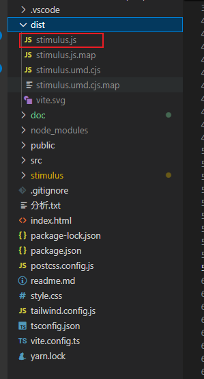
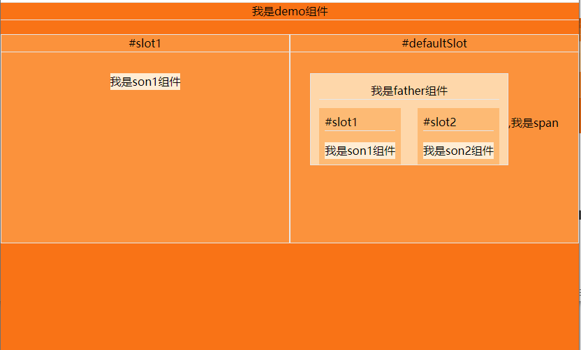

# dev

```sh
#安装依赖
yarn

# 运行开发服务器
yarn dev


```

# build

```sh
# 打包
yarn build:bundle

```



# [框架原理分析(点击跳转)](./doc/stimulus原理分析.md)

# 嵌套最小 demo

## 最终呈现



## 页面结构

```html
<div id="app" data-controller="demo">
  <div id="father" data-controller="father" data-action="click->father#tt">
    <div id="test-1" slot="slot1">
      <div id="li-1" data-controller="son1"></div>
    </div>
    <div id="test-2" slot="slot2">
      <div id="li-2" data-controller="son2"></div>
    </div>
  </div>
  <span>我是span</span>

  <div id="slot1" slot="slot1">
    <div id="son1-controller" data-controller="son1" p@icon=""></div>
  </div>
</div>
```
